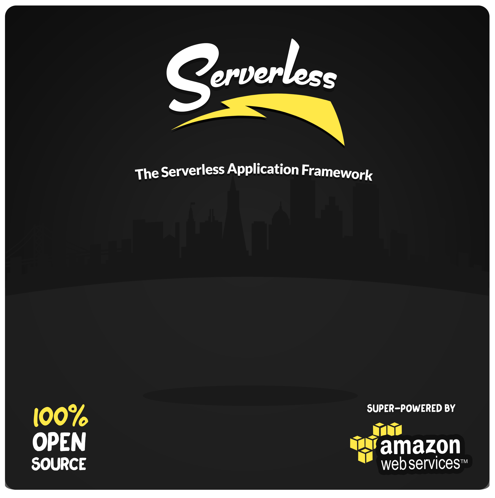

Serverless V0 (BETA) -- Formerly "JAWS"
=================================

####The Serverless Application Framework Powered By Amazon Web Services - [serverless.com](http://www.serverless.com)

**Status 12/8:** We re-branded from JAWS and pushed out a HUGE release on 12/8.  We're now cleaning up bugs, finishing the new docs and cleaning up everything else.  By the end of this week we will have made rapid progress.  Please stay tuned and help us test :)

**Note:** This project was formerly JAWS.

## Links
* [Gitter](https://gitter.im/serverless/serverless)
* [Road Map](https://trello.com/b/EX6SxBJJ/framework)

## Get Started
This is a command line tool.  It requires Node V4.  Install it via npm:
```
npm install serverless -g
```

## Differences From JAWS:

* **Node V4:**  The new Serverless Command Line Tool uses Node V4.  We recommend using Node Version Manager (NVM) to seamlessly upgrade your local version of Node.
* **Name & Filename Changes:**  Having JAWS and AWSM was too confusing.  Now, we're just Serverless and Serverless modules.  Your project JSON is now `s-project.json`, your module JSON is now `s-module.json` and your function JSON is now `s-function.json`.
* **New Function JSON Format:**  Our new function JSON format (`s-function.json`) helps reduce boilerplate.  You can still have 1 folder containing 1 Lambda w/ 1 Endpoint.  However, now you can have 1 folder containing 1 Lambda w/ multiple endpoints.  As well as 1 folder containing multiple Lambdas each with multiple endpoints.  You can point your multiple Lambdas to different handlers on a single file, or to different files within the folder.  It's flexible.
* **One Set Of Lambdas Per Region:**  JAWS created a separate CloudFormation stack of Lambdas for each stage + region.  Serverless creates one set of Lambdas for all stages, and replicates them in every region used by your project.
* **AWS-Recommended Workflow:**  Lambda versioning and aliasing support is automatically included.  Every time you deploy a Lambda, it is versioned and aliased to the stage you targeted your deployment to.  This allows large teams to work on one set of Lambdas per region without trampling eachout.
* **Removed CloudFormation Support For Project Lambdas:**  We no longer use CloudFormation to deploy your Lambdas.  It is too slow and it is behind on features which we would like to support today.  Our `s-function.json` resembles CF syntax, but is leaner and offers an abstraction layer which we will use to assist your workflow further in the near future.  Lambda Function names are also much neater now.
* **1 REST API Containing Your Project's Stages:**  JAWS created a separate REST API on API Gateway for each of your Project stages.  Now, your project just has one REST API and your Project's Stages are added as stages on that REST API.
* **Stage Variable Support:**  Each stage in your API Gateway REST API uses an API Gateway stage variable to point to Lambdas aliased with the same stage name.  By changing that variable, you can point all endpoints inyour REST API Stage to an entirely different set of aliased Lambdas.
* **Plugin Architecture:** Every Action Serverless does is a Plugin.  You can make your own plugins too to add "pre" and "post" hooks on Actions, create custom Actions, or replace an Action entirely.