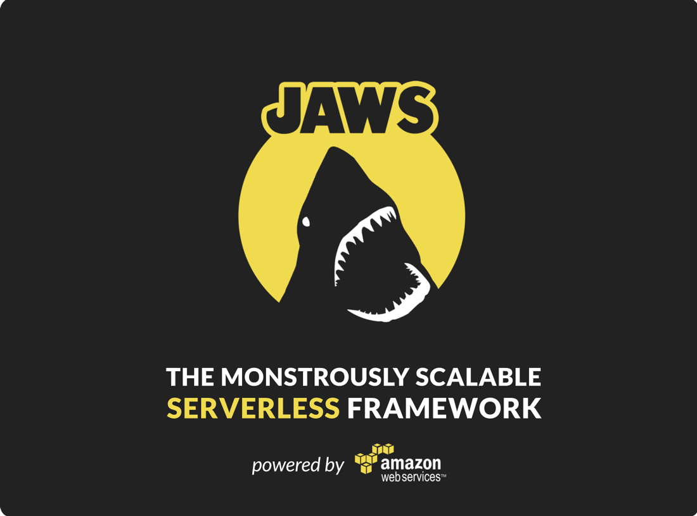
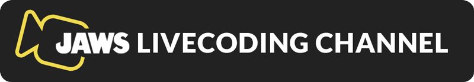

JAWS V1 (BETA)
=================================

JAWS is an open-source framework for building serverless applications (web, mobile, IoT) using Amazon Web Services' Lambda, API Gateway, and more.  Lambda's event-driven model offers tremendous cost savings and colossal horizontal scaling ability.  Now, JAWS helps you build and maintain entire applications built on Lambda.

<a class="frame" href="https://gitter.im/jaws-framework/JAWS?utm_source=badge&utm_medium=badge&utm_campaign=pr-badge" target="_blank"></a>

<br/><br/>

<a href="http://github.us11.list-manage1.com/subscribe?u=b4fad36768cab222f88338995&id=5f8407dded" target="_blank"></a>

<br/><br/>

<a href="https://www.livecoding.tv/jaws/" target="_blank"></a>

<br/><br/>

<a href="https://docs.google.com/document/d/1SeTgtsQc620vcwgGMZ4F2yuWVf-A3JmpTn1VT8pKYsA/edit?usp=sharing" target="_blank"></a>

<br/><br/>

Check us out at .  Our presentation is ["DVO209 - JAWS: The Monstrously Scalable Serverless Framework – AWS Lambda, Amazon API Gateway, and More!"](https://www.portal.reinvent.awsevents.com/connect/sessionDetail.ww?SESSION_ID=5494)

**Status 9/18**: The **JAWS V1 RC1 (v1.0.0)** in now available. Significant re-write.  Few of the many new features: deploy lambdas via CloudFormation. [AWSM: Amazon Web Services Modules](https://github.com/awsm-org/awsm).  Much improved multi-region support.  Totally re-done `env` command.

**[Don't forget to join the JAWS Email List for updates!](http://eepurl.com/bvz5Nj)**

## Goals:

 - **No Servers:** The JAWS back-end is comprised entirely of AWS Lambda Functions.  You can develop/update/configure each separately without affecting any other part of your application.  Your app never goes down.  There is no app.  Only individual lambda functions can go down.
 - **Scale Infinitely:**  A back-end comprised of Lambda functions comes with a ton of concurrency.
 - **Be Cheap As Possible:**  Lambda functions run only when they are called, and you pay only when they are run.
 - **All Lambda Runtimes** While first release is `nodejs` only, we plan on adding support for all languages. This means each lambda in your JAWS project can be coded in the lang that best suites the problem.
 - **API Gateway Auto-Deploy** Creates your API endpoints for you on API Gateway.
 - **Multi-stage & Multi-Region:** Define stages for your project, and multiple regions with a stage. Driven by [CloudFormation](https://aws.amazon.com/cloudformation/).

## Architecture

Graphics coming soon...

## Quick Start

The guide below gets you started quickly.  Later, check out the [best practices](https://github.com/jaws-framework/JAWS/wiki/Best-practices) guide in our  [wiki](https://github.com/jaws-framework/JAWS/wiki) for tips on security and more.

*  **[Setup an AWS account and create an administrative user](https://github.com/jaws-framework/JAWS/wiki/v1:-AWS-Account-setup)**

*  ```$ npm install jaws-framework -g```

*  ```$ jaws new project```

 **Note:** we recommend camelCase for project names. [Why?](https://github.com/jaws-framework/JAWS/wiki/Best-practices#project-names)

*  ```$ cd <new-project-name>```

*  ```$ jaws module create users get```

* ```$ jaws dash```

This will create a new jaws project, create a lambda function  and endpoint (and install [jaws-core-js awsm](https://github.com/jaws-framework/jaws-core-js)), which you can immediately deploy via
`jaws dash`.  After deployment is complete, you will be given a url.  In the above example, you can access your
deployed lambda at `your_url/users/list`.

## Where do I go from here?

We're currently working on our [docs](./docs/), [wiki](https://github.com/jaws-framework/JAWS/wiki), [best practices](https://github.com/jaws-framework/JAWS/wiki/Best-practices) and [FAQ](https://github.com/jaws-framework/JAWS/wiki/FAQ) pages.

Once you become familiar with JAWS, you can read about [JAWS AWSM: Amazon Web Services Modules](https://github.com/awsm-org/awsm) to start contributing awsm's to the community.

## How can I help?

Please check out the **[JAWS V1 Google Document](https://docs.google.com/document/d/1SeTgtsQc620vcwgGMZ4F2yuWVf-A3JmpTn1VT8pKYsA/edit#)** and our [CONTRIBUTING.md](./CONTRIBUTING.md) for coding and PR guidelines.
