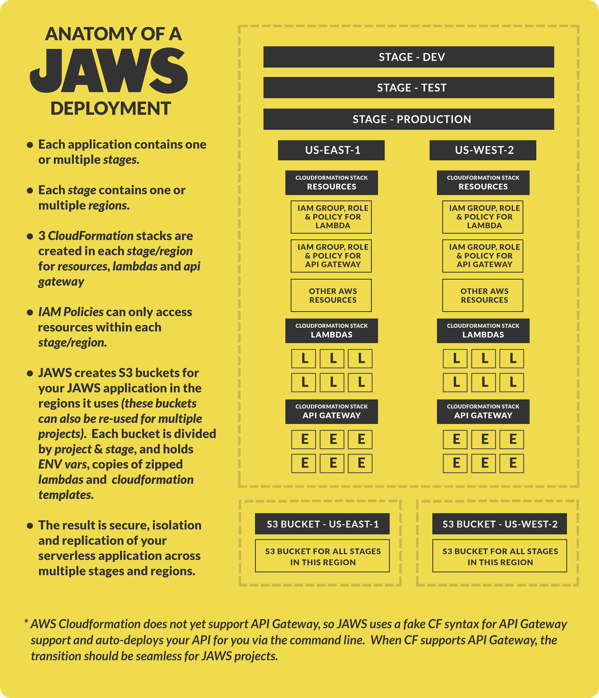

JAWS V1 (BETA)
=================================

**Status 9/21:** We've just release JAWS V1 BETA.  Please test, submit bug fixes and let us know what you think.  We'll be working through the week to improve our documentation and fix bugs.  Check out our Road Map below to see what we're working on next.

JAWS is an open-source framework for building serverless applications (web, mobile, IoT) using Amazon Web Services' Lambda, API Gateway, and more.  Lambda's event-driven model offers tremendous cost savings and colossal horizontal scaling ability.  Now, JAWS helps you build and maintain entire applications built on Lambda.

<a class="frame" href="https://gitter.im/jaws-framework/JAWS?utm_source=badge&utm_medium=badge&utm_campaign=pr-badge" target="_blank"></a>

<br/><br/>

<a href="http://github.us11.list-manage1.com/subscribe?u=b4fad36768cab222f88338995&id=5f8407dded" target="_blank"></a>

<br/><br/>

<a href="https://www.livecoding.tv/jaws/" target="_blank"></a>

<br/><br/>

<a href="https://docs.google.com/document/d/1SeTgtsQc620vcwgGMZ4F2yuWVf-A3JmpTn1VT8pKYsA/edit?usp=sharing" target="_blank"></a>

<br/><br/><br/>

## Quick Start

*  **[Setup an AWS account and create an administrative user](https://github.com/jaws-framework/JAWS/wiki/v1:-AWS-Account-setup)**

*  ```$ npm install jaws-framework -g```

*  ```$ jaws new project```

 **Note:** We recommend camelCase for project names. [Why?](https://github.com/jaws-framework/JAWS/wiki/Best-practices#project-names)

*  ```$ cd <new-project-name>```

*  ```$ jaws module create users list```

* ```$ jaws dash```

This will create a new jaws project, create a lambda function with an API Gateway endpoint, which you can immediately deploy via
`jaws dash`.  After deployment is complete, you will be given a url.  In the above example, you can access your
deployed lambda at `your_url/users/list`.

## Overview:

JAWS is a command line interface that provides structure, automation and optimization to help you build and maintain your serverless apps.  JAWS uses AWS services exclusively, since it relies on AWS's Lambda service to provide event-driven compute resources, and many AWS services integrate nicely with Lambda.

In JAWS V1, we made a strong effort to make not just a groundbreaking serverless framework, but the best framework for building applications with AWS in general (that is also serverless!).  As a result, JAWS V1 incorporates years of AWS expertise into its tooling, giving you best practices out-of-the-box.

A JAWS app can be simply a group of lambda functions to accomplish some tasks, or an entire back-end comprised of hundreds of lambda functions.  All JAWS apps use the directory structure described in the diagram below.  This scaffolding can be generated by running the `jaws new project` command.


Web, mobile and IoT applications can be built on JAWS, since JAWS is mostly a back-end focused framework.  JAWS comes with a `front` folder, but doesn't do much with it (yet).

JAWS applications' back-end runs on AWS Lambda functions which can be seen in the `back` folder.  To encourage the development of re-usable, standardized and optimized lambda functions, JAWS keeps all of your app's lambda functions in the **[AWS-Module](https://github.com/awsm-org/awsm) (awsm)** format.  This format was created for JAWS, and the JAWS CLI features commands to help you generate scaffolding for your aws_modules.

Possibly the best feature of aws_modules is they make it easy for developers to publish and share their lambda functions and encourage a module ecosystem.  In the near future, when you are building your serverless app, you will be able to select from a large variety of pre-written lambda functions, designed by the JAWS community for re-use, optimization, easy installation and deployment!

<p align="center">
<a href="https://github.com/awsm-org/awsm" target="_blank"></a>
</p>

Every JAWS application can have multiple stages and multiple regions within each stage.  JAWS relies heavily on AWS Cloudformation to keep track of all of the AWS resources your application requires in each stage/region.  This way, you can easily provision/replicate your AWS resources at once, and roll back to previous deployments, for every stage/region your application uses.



## Documentation

* **[Commands](docs/commands.md)**


We're currently working on our [docs](./docs/), [wiki](https://github.com/jaws-framework/JAWS/wiki), [best practices](https://github.com/jaws-framework/JAWS/wiki/Best-practices) and [FAQ](https://github.com/jaws-framework/JAWS/wiki/FAQ) pages.

Once you become familiar with JAWS, you can read about [JAWS AWSM: Amazon Web Services Modules](https://github.com/awsm-org/awsm) to start contributing awsm's to the community.

## How can I help?

Please check out the **[JAWS V1 Google Document](https://docs.google.com/document/d/1SeTgtsQc620vcwgGMZ4F2yuWVf-A3JmpTn1VT8pKYsA/edit#)** and our [CONTRIBUTING.md](./CONTRIBUTING.md) for coding and PR guidelines.
