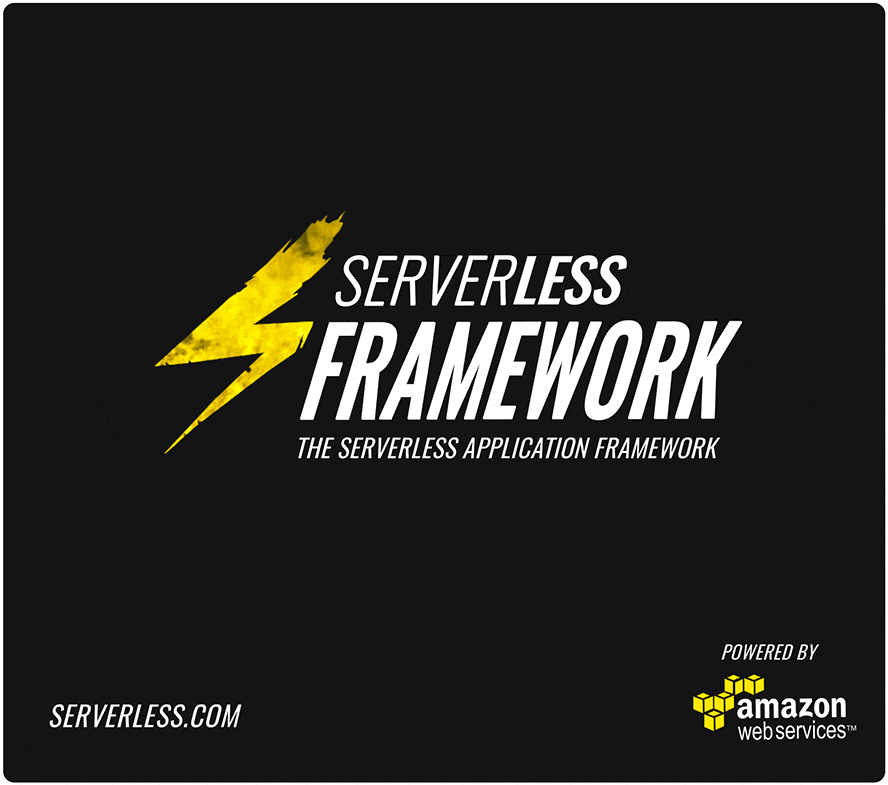

Serverless Framework (BETA)
=================================
[](http://www.serverless.com)
[](https://badge.fury.io/js/serverless)
[](https://gitter.im/serverless/serverless)
[](https://www.npmjs.com/package/serverless)
[](https://www.npmjs.com/package/serverless)

Serverless is the application framework for building web, mobile and IoT applications exclusively on Amazon Web Services' Lambda and API Gateway. It's a command line interface that helps you build and maintain serverless apps across teams of any size.  It's also completely extensible via Plugins.  We believe AWS Lambda will be the focal point of the AWS cloud, and the Serverless Framework interprets AWS from Lambda's perspective.

The Framework and its related tools are maintained by a dedicated, full-time team.  For updates, join our [Mailing List](http://eepurl.com/bvz5Nj).  We work on this live in our [Gitter Chatroom](https://gitter.im/serverless/serverless). Please join us, everyone is welcome :)

Also, we are hiring.  If you are a developer and these tools/ideologies appeal to you and you want to work on these all day long, [please send us a message](mailto:team@serverless.com).

## Features

* Run/test AWS Lambda functions locally, or remotely
* Auto-deploys, versions & aliases your Lambda functions
* Auto-deploys your REST API to AWS API Gateway
* Auto-deploys your Lambda events
* Support for multiple stages
* Support for multiple regions within stages
* Support for separate credentials per stage
* Manage & deploy AWS CloudFormation resources to each stage/region
* Project Variables allow staged/regional values in config files
* Project Templates reduce configuration
* Environment variable support
* Assign multiple endpoints and events to a function
* Interactive CLI dashboard to easily select and deploy functions and endpoints
* Optimize your Lambda functions for faster response times
* Support for API Gateway custom authorizers
* Project files can be published to npm
* 100% Extensible - Extend or modify the Framework and its operations via Plugins
* Powerful classes and methods for easy plugin development
* AWS best practices and optimizations built in
* A fantastic and welcoming community!

## Getting Started

Install The Serverless Framework via npm: (requires Node V4)

```
npm install serverless -g
```

You can either install an existing project or create your own.  We recommend starting out with the [Serverless-Starter](https://www.github.com/serverless/serverless-starter)

```
serverless project install serverless-starter
```

Or you can create your own project

```
serverless project create
```

Refer to our [documentation](http://docs.serverless.com) for more info.  Enjoy!

## Links

* [Documentation](http://docs.serverless.com)
* [Road Map](https://github.com/serverless/serverless/milestones)
* [Changelog](https://github.com/serverless/serverless/releases)
* [Email Updates](http://eepurl.com/bvz5Nj)
* [Gitter Chatroom](https://gitter.im/serverless/serverless) - We are in here all day long!
* [Stackoverflow](http://stackoverflow.com/questions/tagged/serverless-framework)
* [Facebook](https://www.facebook.com/serverless)
* [Twitter](https://twitter.com/goserverless)
* [Serverless Meetups](http://www.meetup.com/serverless/)
* [Contact Us](mailto:team@serverless.com)

## Projects
Serverless Projects are shareable and installable.  You can publish them to npm and install them via the Serverless Framework CLI by using `$ serverless project install <project-name>`
* [serverless-graphql](https://github.com/serverless/serverless-graphql) - Official Serverless boilerplate to kick start your project
* [serverless-starter](https://github.com/serverless/serverless-starter) - A simple boilerplate for new projects with a few architectural options
* [serverless-graphql-blog](https://github.com/serverless/serverless-graphql-blog) - A blog boilerplate that leverages GraphQL in front of DynamoDB to offer a minimal REST API featuring only 1 endpoint
* [serverless-authentication-boilerplate](https://github.com/laardee/serverless-authentication-boilerplate) - A generic authentication boilerplate for Serverless framework 
* [sc5-serverless-boilerplate](https://github.com/SC5/sc5-serverless-boilerplate) - A boilerplate for test driven development of REST endpoints
* [MoonMail] (https://github.com/microapps/MoonMail) - Build your own email marketing infrastructure using Lambda + SES
    
## Plugins
Serverless is composed of Plugins.  A group of default Plugins ship with the Framework, and here are some others you can add to improve/help your workflow:
* [Meta Sync](https://github.com/serverless/serverless-meta-sync) - Securely sync your the variables in your project's `_meta/variables` across your team.
* [Offline](https://github.com/dherault/serverless-offline) - Emulate AWS Lambda and Api Gateway locally to speed up your development cycles.
* [Hook Scripts](https://github.com/kennu/serverless-plugin-hookscripts) - Easily create shell script hooks that are run whenever Serverless actions are executed.
* [CORS](https://github.com/joostfarla/serverless-cors-plugin) - Adds support for CORS (Cross-origin resource sharing).
* [Serve](https://github.com/Nopik/serverless-serve) - Simulate API Gateway locally, so all function calls can be run via localhost.
* [Webpack](https://github.com/asprouse/serverless-webpack-plugin) - Use Webpack to optimize your Serverless Node.js Functions.
* [Serverless Client](https://github.com/serverless/serverless-client-s3) - Deploy and config a web client for your Serverless project to S3.
* [Alerting](https://github.com/martinlindenberg/serverless-plugin-alerting) - This Plugin adds Cloudwatch Alarms with SNS notifications for your Lambda functions.
* [Optimizer](https://github.com/serverless/serverless-optimizer-plugin) - Optimizes your code for performance in Lambda. Supports coffeeify, babelify and other transforms
* [CloudFormation Validator](https://github.com/tmilewski/serverless-resources-validation-plugin) - Adds support for validating your CloudFormation template.
* [Prune](https://github.com/Nopik/serverless-lambda-prune-plugin) - Delete old versions of AWS lambdas from your account so that you don't exceed the code storage limit.
* [Base-Path](https://github.com/daffinity/serverless-base-path-plugin) - Sets a base path for all API Gateway endpoints in a Component.
* [Test](https://github.com/arabold/serverless-test-plugin) - A Simple Integration Test Framework for Serverless.
* [SNS Subscribe](https://github.com/martinlindenberg/serverless-plugin-sns) - This plugin easily subscribes your lambda functions to SNS notifications.
* [JSHint](https://github.com/joostfarla/serverless-jshint-plugin) - Detect errors and potential problems in your Lambda functions.
* [ESLint](https://github.com/nishantjain91/serverless-eslint-plugin) - Detect errors and potential problems in your Lambda functions using eslint.
* [Mocha](https://github.com/SC5/serverless-mocha-plugin) - Enable test driven development by creating test cases when creating new functions
* [Function-Package](https://github.com/HyperBrain/serverless-package-plugin) - Package your lambdas without deploying to AWS.
* [Sentry](https://github.com/arabold/serverless-sentry-plugin) - Automatically send errors and exceptions to [Sentry](https://getsentry.com).
* [Auto-Prune](https://github.com/arabold/serverless-autoprune-plugin) - Delete old AWS Lambda versions.

## Contributing
We love our contributors! If you'd like to contribute to the project, feel free to submit a PR. But please keep in mind the following guidelines:

* Propose your changes before you start working on a PR. You can reach us by submitting a Github issue, or discuss it in the [Gitter Chatroom](https://gitter.im/serverless/serverless). This is just to make sure that no one else is working on the same change, and to figure out the best way to solve the issue.
* If you're out of ideas, but still want to contribute, check out our [Road Map](https://github.com/serverless/serverless/milestones). There's a lot we want to get done, and we'd love your help!
* Contributions are not just PRs! We'd be grateful for having you in our community, and if you could provide some support for new comers, that be great! You can also do that by answering [Serverless related questions on Stackoverflow](http://stackoverflow.com/questions/tagged/serverless-framework).
* You can also contribute by writing. Feel free to let us know if you want to publish a useful original guide in our docs (attributed to you, thank you!) that you feel will help the community.

## Consultants
These consultants use the Serverless Framework and can help you build your serverless projects.
* [Trek10](https://www.trek10.com/)
* [Parallax](https://parall.ax/) – they also built the [David Guetta Campaign](https://serverlesscode.com/post/david-guetta-online-recording-with-lambda/)
* [Just Serverless](http://justserverless.com)
* [SC5 Online](https://sc5.io)
* [Carrot Creative](https://carrot.is)
* [microapps](http://microapps.com)
* [Apiwise](http://www.apiwise.nl)
* [Useful IO](http://useful.io) - and [Hail Messaging](http://hail.io)
* [WhaleTech](https://whaletech.co/)
* [CloudNative](http://cloudnative.io//)
* [Hop Labs](http://www.hoplabs.com)
* [Webscale](https://webscale.fi/briefly-in-english/)
* [API talent](http://www.apitalent.co.nz) - who also run [Serverless-Auckland Meetup](http://www.meetup.com/Serverless-Auckland)
