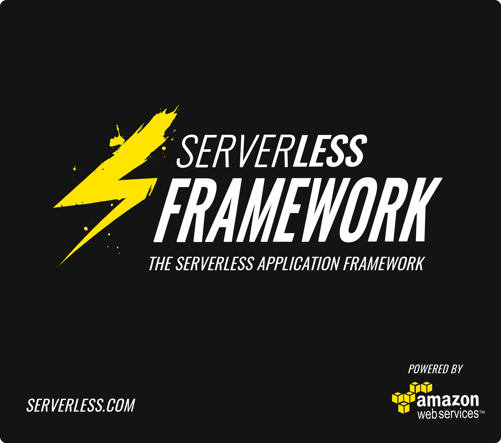

Serverless Framework (BETA)
=================================

Serverless is the application framework for building serverless web, mobile and IoT applications. It's a command line interface that helps you build and maintain Serverless apps across teams of any size.  It's completely extensible via Plugins and developed full-time by a dedicated team.

We believe AWS Lambda will be the focal point of AWS cloud, and the Serverless Framework approaches AWS from that perspective.

We work on this live in our [Gitter Chatroom](https://gitter.im/serverless/serverless). Everyone is welcome :)

## Install

Install The Serverless Framework via npm: (requires Node V4)

```
npm install serverless -g
```

Done!  Refer to our [documentation](http://docs.serverless.com/v0.1.0/docs/) for next steps.

## Features

* Run/test AWS Lambda functions locally
* Auto-deploy, version & alias your Lambda functions
* Auto-deploys your REST API to AWS API Gateway
* Support for multiple stages
* Support for multiple regions within stages
* Manage & deploy AWS CloudFormation resources
* Project Variables & Module Templates to reduce configuration settings
* Environment variable support
* Interactive dashboard to easily select and deploy functions and endpoints
* Optimize your Lambda functions for faster response times
* Components allow for easy sharing of code across Lambda functions
* Shareable project files and modules
* 100% Extensible - Extend or modify the Framework and its operations via Plugins
* Powerful classes and methods for easy plugin development
* AWS best practices and optimizations built in!

## Links

* [Documentation](http://docs.serverless.com/v0.1.0/docs/)
* [Road Map](https://trello.com/b/EX6SxBJJ/serverless)
* [Email Updates](http://eepurl.com/bvz5Nj)
* [Gitter Chatroom](https://gitter.im/serverless/serverless)
* [Stackoverflow](http://stackoverflow.com/questions/tagged/serverless-framework)
* [Facebook](https://www.facebook.com/serverless)
* [Twitter](https://twitter.com/goserverless)
* [Serverless Meetups](http://www.meetup.com/serverless/)
* [Contact Us](mailto:team@serverless.com)

## Plugins
Serverless is comprised of Plugins.  A group of default Plugins ship with the Framework, and here are some others you can add to improve/help your workflow:
* [Plugin Boilerplate](https://github.com/serverless/serverless-plugin-boilerplate) - Make a Serverless Plugin with this simple boilerplate.
* [Serve](https://github.com/Nopik/serverless-serve) - Simulate API Gateway locally, so all function calls can be run via localhost.
* [Alerting](https://github.com/martinlindenberg/serverless-plugin-alerting) - This Plugin adds Cloudwatch Alarms with SNS notifications for your Lambda functions.
* [Optimizer](https://github.com/serverless/serverless-optimizer-plugin) - Optimizes your code for performance in Lambda.
* [CORS](https://github.com/joostfarla/serverless-cors-plugin) - Adds support for CORS (Cross-origin resource sharing).
* [CloudFormation Validator](https://github.com/tmilewski/serverless-resources-validation-plugin) - Adds support for validating your CloudFormation template.
* [Prune](https://github.com/Nopik/serverless-lambda-prune-plugin) - Delete old versions of AWS lambdas from your account so that you don't exceed the code storage limit.
* [Base-Path](https://github.com/daffinity/serverless-base-path-plugin) - Sets a base path for all API Gateway endpoints in a Component.
* [Test](https://github.com/arabold/serverless-test-plugin) - A Simple Integration Test Framework for Serverless.
* [SNS Subscribe](https://github.com/martinlindenberg/serverless-plugin-sns) This plugin easily subscribes your lambda functions to SNS notifications.

## Contributing
We love our contributors! If you'd like to contribute to the project, feel free to submit a PR. But please keep in mind the following guidelines:

* Propose your changes before you start working on a PR. You can reach us by submitting a Github issue, or discuss it in the [Gitter Chatroom](https://gitter.im/serverless/serverless). This is just to make sure that no one else is working on the same change, and to figure out the best way to solve the issue.
* If you're out of ideas, but still want to contribute, check out our [Road Map](https://trello.com/b/EX6SxBJJ/serverless). There's a lot we want to get done, and we'd love your help!
* Contributions are not just PRs! We'd be grateful for having you in our community, and if you could provide some support for new comers, that be great! You can also do that by answering [Serverless related questions on Stackoverflow](http://stackoverflow.com/questions/tagged/serverless-framework).
* You can also contribute by writing. Feel free to let us know if you want to publish a useful original guide in our docs (attributed to you, thank you!) that you feel will help the community.
