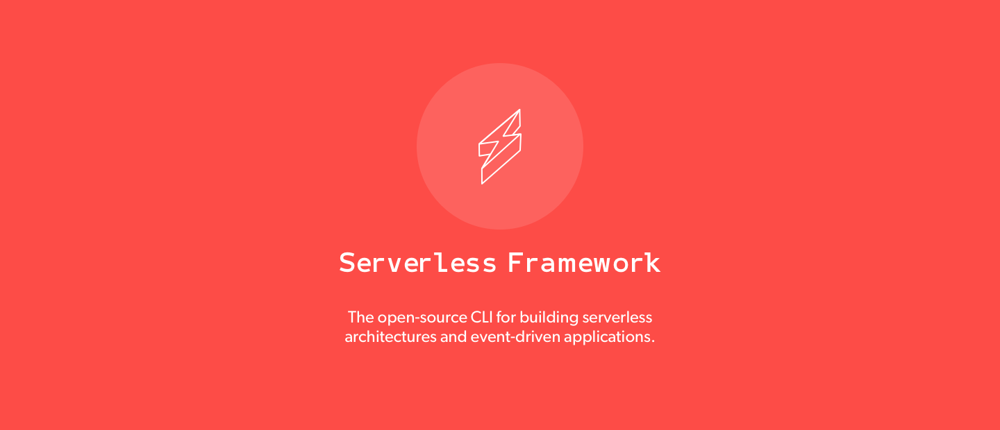

[](http://serverless.com)

[](http://www.serverless.com)
[](https://travis-ci.org/serverless/serverless)
[](https://badge.fury.io/js/serverless)
[](https://coveralls.io/github/serverless/serverless?branch=master)
[](https://gitter.im/serverless/serverless)
[](https://www.npmjs.com/package/serverless)
[](https://www.npmjs.com/package/serverless)

[Website](http://www.serverless.com) • [Docs](https://serverless.com/framework/docs/) • [Newsletter](http://eepurl.com/b8dv4P) • [Gitter](https://gitter.im/serverless/serverless) • [Forum](http://forum.serverless.com) • [Meetups](https://github.com/serverless-meetups/main) • [Twitter](https://twitter.com/goserverless) • [We're Hiring](https://serverless.com/company/jobs/)

**The Serverless Framework** – Build applications comprised of microservices that run in response to events, auto-scale for you, and only charge you when they run.  This lowers the total cost of maintaining your apps, enabling you to build more logic, faster.

The Framework uses new event-driven compute services, like AWS Lambda, Google Cloud Functions, and more.  It's a command-line tool, providing scaffolding, workflow automation and best practices for developing and deploying your serverless architecture. It's also completely extensible via plugins.

Serverless is an MIT open-source project, actively maintained by a full-time, venture-backed team.

<a href="https://serverless.com/framework/" target="_blank">Watch the video guide here.</a>

<a href="https://goo.gl/forms/4AvkCrSf5oDOytDv1" target="_blank">Serverless Framework Feedback Survey</a>

## Contents


* [Quick Start](#quick-start)
* [Examples](https://github.com/serverless/examples)
* [Services](#services)
* [Features](#features)
* [Plugins](#v1-plugins)
* [Example Projects](#v1-projects)
* [Contributing](#contributing)
* [Community](#community)
* [Consultants](#consultants)
* [Licensing](#licensing)
* [Previous Version 0.5.x](#v.5)

## <a name="quick-start"></a>Quick Start

[Watch the video guide here](https://serverless.com/framework/) or follow the steps below to create and deploy your first serverless microservice in minutes.

1. **Install via npm:**
  ```bash
  npm install -g serverless
  ```

2. **Set-up your [Provider Credentials](./docs/providers/aws/guide/credentials.md)**. [Watch the video on setting up credentials](https://www.youtube.com/watch?v=HSd9uYj2LJA)

3. **Create a Service:**

  You can create a new service or [install existing services](#how-to-install-a-service).
  ```bash
  # Create a new Serverless Service/Project
  serverless create --template aws-nodejs --path my-service
  # Change into the newly created directory
  cd my-service
  ```

4. **Deploy a Service:**

  Use this when you have made changes to your Functions, Events or Resources in `serverless.yml` or you simply want to deploy all changes within your Service at the same time.
  ```bash
  serverless deploy -v
  ```

5. **Deploy the Function:**

  Use this to quickly upload and overwrite your AWS Lambda code on AWS, allowing you to develop faster.
  ```bash
  serverless deploy function -f hello
  ```

6. **Invoke the Function:**

  Invokes an AWS Lambda Function on AWS and returns logs.
  ```bash
  serverless invoke -f hello -l
  ```

7. **Fetch the Function Logs:**

  Open up a separate tab in your console and stream all logs for a specific Function using this command.
  ```bash
  serverless logs -f hello -t
  ```

8. **Remove the Service:**

  Removes all Functions, Events and Resources from your AWS account.
  ```bash
  serverless remove
  ```

### How to Install a Service:

This is a convenience method to install a pre-made Serverless Service locally by downloading the Github repo and unzipping it.  Services are listed below.

```bash
serverless install -u https://github.com/your-url-to-the-serverless-service
```

Check out the [Serverless Framework Guide](./docs/providers/aws/guide/README.md) for more information.

## <a name="services"></a>Services (V1.0)

The following are services you can instantly install and use by running `serverless install --url <service-github-url>`

* [serverless-examples](https://github.com/serverless/examples)
* [CRUD](https://github.com/pmuens/serverless-crud) - CRUD service, [Scala Port](https://github.com/jahangirmohammed/serverless-crud-scala)
* [CRUD with FaunaDB](https://github.com/faunadb/serverless-crud) - CRUD service using FaunaDB
* [CRUD with S3](https://github.com/tscanlin/serverless-s3-crud) - CRUD service using S3
* [GraphQL Boilerplate](https://github.com/serverless/serverless-graphql) - GraphQL application Boilerplate service
* [Authentication](https://github.com/laardee/serverless-authentication-boilerplate) - Authentication boilerplate service
* [Mailer](https://github.com/eahefnawy/serverless-mailer) - Service for sending emails
* [Kinesis streams](https://github.com/pmuens/serverless-kinesis-streams) - Service to showcase Kinesis stream support
* [DynamoDB streams](https://github.com/pmuens/serverless-dynamodb-streams) - Service to showcase DynamoDB stream support
* [Landingpage backend](https://github.com/pmuens/serverless-landingpage-backend) - Landingpage backend service to store E-Mail addresses
* [Facebook Messenger Chatbot](https://github.com/pmuens/serverless-facebook-messenger-bot) - Chatbot for the Facebook Messenger platform
* [Lambda chaining](https://github.com/pmuens/serverless-lambda-chaining) - Service which chains Lambdas through SNS
* [Secured API](https://github.com/pmuens/serverless-secured-api) - Service which exposes an API key accessible API
* [Authorizer](https://github.com/eahefnawy/serverless-authorizer) - Service that uses API Gateway custom authorizers
* [Thumbnails](https://github.com/eahefnawy/serverless-thumbnails) - Service that takes an image url and returns a 100x100 thumbnail
* [Boilerplate](https://github.com/eahefnawy/serverless-boilerplate) - Opinionated boilerplate
* [ES6 + Jest](https://github.com/americansystems/serverless-es6-jest) - ES6 + Jest Boilerplate
* [PHP](https://github.com/ZeroSharp/serverless-php) - Call a PHP function from your lambda
* [Ruby](https://github.com/stewartlord/serverless-ruby) - Call a Ruby function from your lambda
* [Slack App](https://github.com/johnagan/serverless-slack-app) - Slack App Boilerplate with OAuth and Bot actions
* [Swift](https://github.com/choefele/swift-lambda-app) - Full-featured project template to develop Lambda functions in Swift
* [Cloudwatch Alerts on Slack](https://github.com/dav009/serverless-aws-alarms-notifier) - Get AWS Cloudwatch alerts notifications on Slack

**Note**: the `serverless install` command will only work on V1.0 or later.

## <a name="features"></a>Features

* Supports Node.js, Python, Java, Scala, C#, F#, Go, Groovy, Kotlin, PHP & Swift.
* Manages the lifecycle of your serverless architecture (build, deploy, update, delete).
* Safely deploy functions, events and their required resources together via provider resource managers (e.g., AWS CloudFormation).
* Functions can be grouped ("serverless services") for easy management of code, resources & processes, across large projects & teams.
* Minimal configuration and scaffolding.
* Built-in support for multiple stages.
* Optimized for CI/CD workflows.
* Loaded with automation, optimization and best practices.
* 100% Extensible: Extend or modify the Framework and its operations via Plugins.
* An ecosystem of serverless services and plugins.
* A passionate and welcoming community!

## <a name="v1-plugins"></a>Plugins (V1.0)

Use these plugins to extend or overwrite the Framework's functionality.

[Add a plugin to this list](https://github.com/serverless/community-plugins/blob/master/plugins.json)

<!-- AUTO-GENERATED-CONTENT:START (GENERATE_SERVERLESS_PLUGIN_TABLE)
This table is generated from https://github.com/serverless/plugins/blob/master/plugins.json please make additions there
-->
| Plugin | Author |
| :----- | :----: |
| **[Go Serverless](https://github.com/thepauleh/goserverless)** <br/> GoFormation for Serverless. Create serverless configs with Go Structs. | [thepauleh](http://github.com/thepauleh) |
| **[Raml Serverless](https://github.com/andrewcurioso/raml-serverless)** <br/> Serverless plugin to work with RAML API spec documents | [andrewcurioso](http://github.com/andrewcurioso) |
| **[Serverless Alexa Plugin](https://github.com/rajington/serverless-alexa-plugin)** <br/> Serverless plugin to support Alexa Lambda events | [rajington](http://github.com/rajington) |
| **[Serverless Alexa Skills](https://github.com/marcy-terui/serverless-alexa-skills)** <br/> Manage your Alexa Skills with Serverless Framework. | [marcy-terui](http://github.com/marcy-terui) |
| **[Serverless Aliyun Function Compute](https://github.com/aliyun/serverless-aliyun-function-compute)** <br/> Serverless Alibaba Cloud Function Compute Plugin | [aliyun](http://github.com/aliyun) |
| **[Serverless Api Cloudfront](https://github.com/Droplr/serverless-api-cloudfront)** <br/> Plugin that adds CloudFront distribution in front of your API Gateway for custom domain, CDN caching and access log. | [Droplr](http://github.com/Droplr) |
| **[Serverless Api Stage](https://github.com/leftclickben/serverless-api-stage)** <br/> Serverless API Stage plugin, enables stage variables and logging for AWS API Gateway. | [leftclickben](http://github.com/leftclickben) |
| **[Serverless Apib Validator](https://github.com/onlicar/serverless-apib-validator)** <br/> Validate that an API Blueprint has full coverage over a Serverless config | [onlicar](http://github.com/onlicar) |
| **[Serverless Apig S 3](https://github.com/sdd/serverless-apig-s3)** <br/> Serve static front-end content from S3 via the API Gateway and deploy client bundle to S3. | [sdd](http://github.com/sdd) |
| **[Serverless Apigateway Plugin](https://github.com/GFG/serverless-apigateway-plugin)** <br/> Configure the AWS api gateway: Binary support, Headers and Body template mappings | [GFG](http://github.com/GFG) |
| **[Serverless Apigw Binary](https://github.com/maciejtreder/serverless-apigw-binary)** <br/> Plugin to enable binary support in AWS API Gateway. | [maciejtreder](http://github.com/maciejtreder) |
| **[Serverless Apigwy Binary](https://github.com/ryanmurakami/serverless-apigwy-binary)** <br/> Serverless plugin for configuring API Gateway to return binary responses | [ryanmurakami](http://github.com/ryanmurakami) |
| **[Serverless Appsync Plugin](https://github.com/sid88in/serverless-appsync-plugin)** <br/> Serverless Plugin to deploy AppSync GraphQL API | [sid88in](http://github.com/sid88in) |
| **[Serverless Attach Managed Policy](https://github.com/Nordstrom/serverless-attach-managed-policy)** <br/> A Serverless plugin to automatically attach an AWS Managed IAM Policy (or Policies) to all IAM Roles created by the Service. | [Nordstrom](http://github.com/Nordstrom) |
| **[Serverless Aws Alias](https://github.com/HyperBrain/serverless-aws-alias)** <br/> This plugin enables use of AWS aliases on Lambda functions. | [HyperBrain](http://github.com/HyperBrain) |
| **[Serverless Aws Documentation](https://github.com/9cookies/serverless-aws-documentation)** <br/> Serverless plugin to add documentation and models to the serverless generated API Gateway | [9cookies](http://github.com/9cookies) |
| **[Serverless Aws Nested Stacks](https://github.com/concon121/serverless-plugin-nested-stacks)** <br/> Yet another AWS nested stack plugin! | [concon121](http://github.com/concon121) |
| **[Serverless Aws Resource Names](https://github.com/concon121/serverless-plugin-aws-resource-names)** <br/> Serverless plugin to alter the default naming conventions for sls resources via a simple mapping file. | [concon121](http://github.com/concon121) |
| **[Serverless Build Plugin](https://github.com/nfour/serverless-build-plugin)** <br/> A Node.js focused build plugin for serverless. | [nfour](http://github.com/nfour) |
| **[Serverless Cf Vars](https://gitlab.com/kabo/serverless-cf-vars)** <br/> Enables use of AWS pseudo functions and Fn::Sub string substitution | [kabo](http://github.com/kabo) |
| **[Serverless Cljs Plugin](https://github.com/nervous-systems/serverless-cljs-plugin)** <br/> Enables Clojurescript as an implementation language for Lambda handlers | [nervous-systems](http://github.com/nervous-systems) |
| **[Serverless Cloudformation Changesets](https://github.com/trek10inc/serverless-cloudformation-changesets)** <br/> Natively deploy to CloudFormation via Change sets, instead of directly. Allowing you to queue changes, and safely require escalated roles for final deployment. | [trek10inc](http://github.com/trek10inc) |
| **[Serverless Cloudformation Parameter Setter](https://github.com/trek10inc/serverless-cloudformation-parameter-setter)** <br/> Set CloudFormation parameters when deploying. | [trek10inc](http://github.com/trek10inc) |
| **[Serverless Cloudformation Resource Counter](https://github.com/drexler/serverless-cloudformation-resource-counter)** <br/> A plugin to count the resources generated in the AWS CloudFormation stack after deployment. | [drexler](http://github.com/drexler) |
| **[Serverless Cloudformation Sub Variables](https://github.com/santiagocardenas/serverless-cloudformation-sub-variables)** <br/> Serverless framework plugin for easily supporting AWS CloudFormation Sub function variables | [santiagocardenas](http://github.com/santiagocardenas) |
| **[Serverless Coffeescript](https://github.com/duanefields/serverless-coffeescript)** <br/> A Serverless plugin to compile your CoffeeScript into JavaScript at deployment | [duanefields](http://github.com/duanefields) |
| **[Serverless Command Line Event Args](https://github.com/horike37/serverless-command-line-event-args)** <br/> This module is Serverless Framework plugin. Event JSON passes to your Lambda function in commandline. | [horike37](http://github.com/horike37) |
| **[Serverless Content Encoding](https://github.com/xeno-dohai/serverless-content-encoding)** <br/> Enable Content Encoding in AWS API Gateway during deployment | [xeno-dohai](http://github.com/xeno-dohai) |
| **[Serverless Crypt](https://github.com/marcy-terui/serverless-crypt)** <br/> Securing the secrets on Serverless Framework by AWS KMS encryption. | [marcy-terui](http://github.com/marcy-terui) |
| **[Serverless Custom Packaging Plugin](https://github.com/hypoport/serverless-custom-packaging-plugin)** <br/> Plugin to package your sourcecode using a custom target path inside the zip. | [hypoport](http://github.com/hypoport) |
| **[Serverless Dir Config Plugin](https://github.com/economysizegeek/serverless-dir-config-plugin)** <br/> EXPERIMENTAL - Serverless plugin to load function and resource definitions from a directory. | [economysizegeek](http://github.com/economysizegeek) |
| **[Serverless Domain Manager](https://github.com/amplify-education/serverless-domain-manager)** <br/> Serverless plugin for managing custom domains with API Gateways. | [amplify-education](http://github.com/amplify-education) |
| **[Serverless Dotenv](https://github.com/Jimdo/serverless-dotenv)** <br/> Fetch environment variables and write it to a .env file | [Jimdo](http://github.com/Jimdo) |
| **[Serverless Dotnet](https://github.com/fruffin/serverless-dotnet)** <br/> A serverless plugin to run 'dotnet' commands as part of the deploy process | [fruffin](http://github.com/fruffin) |
| **[Serverless Dynalite](https://github.com/sdd/serverless-dynalite)** <br/> Run dynalite locally (no JVM, all JS) to simulate DynamoDB. Watch serverless.yml for table config updates. | [sdd](http://github.com/sdd) |
| **[Serverless Dynamodb Autoscaling](https://github.com/sbstjn/serverless-dynamodb-autoscaling)** <br/> Configure Amazon DynamoDB's native Auto Scaling for your table capacities. | [sbstjn](http://github.com/sbstjn) |
| **[Serverless Dynamodb Local](https://github.com/99xt/serverless-dynamodb-local)** <br/> Serverless Dynamodb Local Plugin - Allows to run dynamodb locally for serverless | [99xt](http://github.com/99xt) |
| **[Serverless Dynamodb Ttl](https://github.com/Jimdo/serverless-dynamodb-ttl)** <br/> Configure DynamoDB TTL in serverless.yml (until CloudFormation supports this). | [Jimdo](http://github.com/Jimdo) |
| **[Serverless Enable Api Logs](https://github.com/paulSambolin/serverless-enable-api-logs)** <br/> Enables Coudwatch logging for API Gateway events | [paulSambolin](http://github.com/paulSambolin) |
| **[Serverless Env Generator](https://github.com/DieProduktMacher/serverless-env-generator)** <br/> Manage environment variables with YAML and load them with dotenv. Supports variable encryption with KMS, multiple stages and custom profiles. | [DieProduktMacher](http://github.com/DieProduktMacher) |
| **[Serverless Ephemeral](https://github.com/Accenture/serverless-ephemeral)** <br/> Build and include custom stateless libraries for any language | [Accenture](http://github.com/Accenture) |
| **[Serverless Event Constant Inputs](https://github.com/dittto/serverless-event-constant-inputs)** <br/> Allows you to add constant inputs to events in Serverless 1.0. For more info see [constant values in Cloudwatch](https://aws.amazon.com/blogs/compute/simply-serverless-use-constant-values-in-cloudwatch-event-triggered-lambda-functions/) | [dittto](http://github.com/dittto) |
| **[Serverless Export Env](https://github.com/arabold/serverless-export-env)** <br/> Export environment variables into a .env file with automatic AWS CloudFormation reference resolution. | [arabold](http://github.com/arabold) |
| **[Serverless Express](https://github.com/mikestaub/serverless-express)** <br/> Making express app development compatible with serverless framework. | [mikestaub](http://github.com/mikestaub) |
| **[Serverless Functions Base Path](https://github.com/kevinrambaud/serverless-functions-base-path)** <br/> Easily define a base path where your serverless functions are located. | [kevinrambaud](http://github.com/kevinrambaud) |
| **[Serverless Go Build](https://github.com/sean9keenan/serverless-go-build)** <br/> Build go source files (or public functions) using yml definition file | [sean9keenan](http://github.com/sean9keenan) |
| **[Serverless Gulp](https://github.com/rhythminme/serverless-gulp)** <br/> A thin task wrapper around @goserverless that allows you to automate build, test and deploy tasks using gulp | [rhythminme](http://github.com/rhythminme) |
| **[Serverless Haskell](https://github.com/seek-oss/serverless-haskell)** <br/> Deploying Haskell applications to AWS Lambda with Serverless | [seek-oss](http://github.com/seek-oss) |
| **[Serverless Hooks Plugin](https://github.com/uswitch/serverless-hooks-plugin)** <br/> Run arbitrary commands on any lifecycle event in serverless | [uswitch](http://github.com/uswitch) |
| **[Serverless Iam Roles Per Function](https://github.com/functionalone/serverless-iam-roles-per-function)** <br/> Serverless Plugin for easily defining IAM roles per function via the use of iamRoleStatements at the function level. | [functionalone](http://github.com/functionalone) |
| **[Serverless Iot Local](https://github.com/tradle/serverless-iot-local)** <br/> AWS Iot events with serverless-offline | [tradle](http://github.com/tradle) |
| **[Serverless Jest Plugin](https://github.com/SC5/serverless-jest-plugin)** <br/> A Serverless Plugin for the Serverless Framework which adds support for test-driven development using Jest | [SC5](http://github.com/SC5) |
| **[Serverless Kms Secrets](https://github.com/SC5/serverless-kms-secrets)** <br/> Allows to easily encrypt and decrypt secrets using KMS from the serverless CLI | [SC5](http://github.com/SC5) |
| **[Serverless Kubeless](https://github.com/serverless/serverless-kubeless)** <br/> Serverless plugin for deploying functions to Kubeless. | [serverless](http://github.com/serverless) |
| **[Serverless Local Dev Server](https://github.com/DieProduktMacher/serverless-local-dev-server)** <br/> Speeds up development of Alexa Skills, Chatbots and APIs by exposing your functions as local HTTP endpoints and mapping received events. | [DieProduktMacher](http://github.com/DieProduktMacher) |
| **[Serverless Local Environment](https://github.com/piercus/serverless-local-environment)** <br/> Serverless plugin to set local environment variables and remote environment variable to different values | [piercus](http://github.com/piercus) |
| **[Serverless Local Schedule](https://github.com/UnitedIncome/serverless-local-schedule)** <br/> Schedule AWS CloudWatch Event based invocations in local time(with DST support!) | [UnitedIncome](http://github.com/UnitedIncome) |
| **[Serverless Log Forwarding](https://github.com/amplify-education/serverless-log-forwarding)** <br/> Serverless plugin for forwarding CloudWatch logs to another Lambda function. | [amplify-education](http://github.com/amplify-education) |
| **[Serverless Micro](https://github.com/barstoolsports/serverless-micro)** <br/> Plugin to help manage multiple micro services under one main service. | [barstoolsports](http://github.com/barstoolsports) |
| **[Serverless Mocha Plugin](https://github.com/SC5/serverless-mocha-plugin)** <br/> A Serverless Plugin for the Serverless Framework which adds support for test-driven development using Mocha | [SC5](http://github.com/SC5) |
| **[Serverless Multi Dotnet](https://github.com/tsibelman/serverless-multi-dotnet)** <br/> A serverless plugin to pack C# lambdas functions that are spread to multiple CS projects. | [tsibelman](http://github.com/tsibelman) |
| **[Serverless Nested Stack](https://github.com/jagdish-176/serverless-nested-stack)** <br/> A plugin to Workaround for Cloudformation 200 resource limit | [jagdish-176](http://github.com/jagdish-176) |
| **[Serverless Offline](https://github.com/dherault/serverless-offline)** <br/> Emulate AWS λ and API Gateway locally when developing your Serverless project | [dherault](http://github.com/dherault) |
| **[Serverless Offline Direct Lambda](https://github.com/civicteam/serverless-offline-direct-lambda)** <br/> Allow offline direct lambda-to-lambda interactions by exposing lambdas with no API Gateway event via HTTP. | [civicteam](http://github.com/civicteam) |
| **[Serverless Offline Scheduler](https://github.com/ajmath/serverless-offline-scheduler)** <br/> Runs scheduled functions offline while integrating with serverless-offline | [ajmath](http://github.com/ajmath) |
| **[Serverless Offline Sns](https://github.com/mj1618/serverless-offline-sns)** <br/> Serverless plugin to run a local SNS server and call serverless SNS handlers with events notifications. | [mj1618](http://github.com/mj1618) |
| **[Serverless Offline Ssm](https://github.com/janders223/serverless-offline-ssm)** <br/> Read SSM parameters from a .env file instead of AWS | [janders223](http://github.com/janders223) |
| **[Serverless Package Common](https://github.com/onlicar/serverless-package-common)** <br/> Deploy microservice Python Serverless services with common code | [onlicar](http://github.com/onlicar) |
| **[Serverless Package Python Functions](https://github.com/ubaniabalogun/serverless-package-python-functions)** <br/> Packaging Python Lambda functions with only the dependencies/requirements they need. | [ubaniabalogun](http://github.com/ubaniabalogun) |
| **[Serverless Parameters](https://github.com/svdgraaf/serverless-parameters)** <br/> Add parameters to the generated cloudformation templates | [svdgraaf](http://github.com/svdgraaf) |
| **[Serverless Plugin Api Docs](https://github.com/8select/serverless-plugin-api-docs)** <br/> Serverless plugin to automatically create a lambda function which returns Swagger-UI HTML API Documentation Page based on the given swagger spec JSON file. | [8select](http://github.com/8select) |
| **[Serverless Plugin Aws Alerts](https://github.com/ACloudGuru/serverless-plugin-aws-alerts)** <br/> A Serverless plugin to easily add CloudWatch alarms to functions | [ACloudGuru](http://github.com/ACloudGuru) |
| **[Serverless Plugin Aws Resolvers](https://github.com/DopplerLabs/serverless-plugin-aws-resolvers)** <br/> Resolves variables from ESS, RDS, or Kinesis for serverless services | [DopplerLabs](http://github.com/DopplerLabs) |
| **[Serverless Plugin Bespoken](https://github.com/bespoken/serverless-plugin-bespoken)** <br/> Creates a local server and a proxy so you don't have to deploy anytime you want to test your code | [bespoken](http://github.com/bespoken) |
| **[Serverless Plugin Bind Deployment Id](https://github.com/jacob-meacham/serverless-plugin-bind-deployment-id)** <br/> A Serverless plugin to bind the randomly generated deployment resource to your custom resources | [jacob-meacham](http://github.com/jacob-meacham) |
| **[Serverless Plugin Browserifier](https://github.com/digitalmaas/serverless-plugin-browserifier)** <br/> Reduce the size and speed up your Node.js based lambda's using browserify. | [digitalmaas](http://github.com/digitalmaas) |
| **[Serverless Plugin Browserify](https://github.com/doapp-ryanp/serverless-plugin-browserify)** <br/> Speed up your node based lambda's | [doapp-ryanp](http://github.com/doapp-ryanp) |
| **[Serverless Plugin Canary Deployments](https://github.com/davidgf/serverless-plugin-canary-deployments)** <br/> A Serverless plugin to implement canary deployments of Lambda functions | [davidgf](http://github.com/davidgf) |
| **[Serverless Plugin Cfauthorizer](https://github.com/SC5/serverless-plugin-cfauthorizer)** <br/> This plugin allows you to define your own API Gateway Authorizers as the Serverless CloudFormation resources and apply them to HTTP endpoints. | [SC5](http://github.com/SC5) |
| **[Serverless Plugin Chrome](https://github.com/adieuadieu/serverless-chrome/tree/master/packages/serverless-plugin)** <br/> Plugin which bundles and ensures that Headless Chrome/Chromium is running when your AWS Lambda function handler is invoked. | [adieuadieu](http://github.com/adieuadieu) |
| **[Serverless Plugin Cloudwatch Sumologic](https://github.com/ACloudGuru/serverless-plugin-cloudwatch-sumologic)** <br/> Plugin which auto-subscribes a log delivery lambda function to lambda log groups created by serverless | [ACloudGuru](http://github.com/ACloudGuru) |
| **[Serverless Plugin Common Excludes](https://github.com/dougmoscrop/serverless-plugin-common-excludes)** <br/> Adds commonly excluded files to package.excludes | [dougmoscrop](http://github.com/dougmoscrop) |
| **[Serverless Plugin Custom Domain](https://github.com/dougmoscrop/serverless-plugin-custom-domain)** <br/> Reliably sets a BasePathMapping to an API Gateway Custom Domain | [dougmoscrop](http://github.com/dougmoscrop) |
| **[Serverless Plugin Deploy Environment](https://github.com/DopplerLabs/serverless-plugin-deploy-environment)** <br/> Plugin to manage deployment environment across stages | [DopplerLabs](http://github.com/DopplerLabs) |
| **[Serverless Plugin Diff](https://github.com/nicka/serverless-plugin-diff)** <br/> Compares your local AWS CloudFormation templates against deployed ones. | [nicka](http://github.com/nicka) |
| **[Serverless Plugin Dynamodb Autoscaling](https://github.com/medikoo/serverless-plugin-dynamodb-autoscaling)** <br/> Auto generate auto scaling configuration for configured DynamoDB tables | [medikoo](http://github.com/medikoo) |
| **[Serverless Plugin Elastic Beanstalk](https://github.com/rawphp/serverless-plugin-elastic-beanstalk)** <br/> A serverless plugin to deploy applications to AWS ElasticBeanstalk. | [rawphp](http://github.com/rawphp) |
| **[Serverless Plugin Encode Env Var Objects](https://github.com/yonomi/serverless-plugin-encode-env-var-objects)** <br/> Serverless plugin to encode any environment variable objects. | [yonomi](http://github.com/yonomi) |
| **[Serverless Plugin External Sns Events](https://github.com/silvermine/serverless-plugin-external-sns-events)** <br/> Add ability for functions to use existing or external SNS topics as an event source | [silvermine](http://github.com/silvermine) |
| **[Serverless Plugin Git Variables](https://github.com/jacob-meacham/serverless-plugin-git-variables)** <br/> A Serverless plugin to expose git variables (branch name, HEAD description, full commit hash) to your serverless services | [jacob-meacham](http://github.com/jacob-meacham) |
| **[Serverless Plugin Graphiql](https://github.com/bencooling/serverless-plugin-graphiql)** <br/> A Serverless plugin to run a local http server for graphiql and your graphql handler | [bencooling](http://github.com/bencooling) |
| **[Serverless Plugin Include Dependencies](https://github.com/dougmoscrop/serverless-plugin-include-dependencies)** <br/> This is a Serverless plugin that should make your deployed functions smaller. | [dougmoscrop](http://github.com/dougmoscrop) |
| **[Serverless Plugin Inject Dependencies](https://github.com/loanmarket/serverless-plugin-inject-dependencies)** <br/> Painlessly deploy serverless projects with only the required dependencies. | [loanmarket](http://github.com/loanmarket) |
| **[Serverless Plugin Iopipe](https://github.com/iopipe/serverless-plugin-iopipe)** <br/> See inside your Lambda functions with high fidelity metrics and monitoring. | [iopipe](http://github.com/iopipe) |
| **[Serverless Plugin Lambda Dead Letter](https://github.com/gmetzker/serverless-plugin-lambda-dead-letter)** <br/> A Serverless plugin that can configure a lambda with a dead letter queue or topic | [gmetzker](http://github.com/gmetzker) |
| **[Serverless Plugin Log Subscription](https://github.com/dougmoscrop/serverless-plugin-log-subscription)** <br/> Adds a CloudWatch LogSubscription for functions | [dougmoscrop](http://github.com/dougmoscrop) |
| **[Serverless Plugin Metric](https://github.com/alex20465/serverless-plugin-metric)** <br/> Creates dynamically AWS metric-filter resources with custom patterns | [alex20465](http://github.com/alex20465) |
| **[Serverless Plugin Multiple Responses](https://github.com/silvermine/serverless-plugin-multiple-responses)** <br/> Enable multiple content-types for Response template  | [silvermine](http://github.com/silvermine) |
| **[Serverless Plugin Node Shim](https://github.com/jzimmek/serverless-plugin-node-shim)** <br/> Serverless plugin to run your functions in nodejs version (8 LTS, 9+) on aws lambda | [jzimmek](http://github.com/jzimmek) |
| **[Serverless Plugin Offline Kinesis Events](https://github.com/DopplerLabs/serverless-plugin-offline-kinesis-events)** <br/> Plugin that works with serverless-offline to allow offline testing of serverless functions that are triggered by Kinesis events. | [DopplerLabs](http://github.com/DopplerLabs) |
| **[Serverless Plugin Optimize](https://github.com/FidelLimited/serverless-plugin-optimize)** <br/> Bundle with Browserify, transpile with Babel to ES5 and minify with Uglify your Serverless functions. | [FidelLimited](http://github.com/FidelLimited) |
| **[Serverless Plugin Package Dotenv File](https://github.com/ACloudGuru/serverless-plugin-package-dotenv-file)** <br/> A Serverless plugin to copy a .env file into the serverless package | [ACloudGuru](http://github.com/ACloudGuru) |
| **[Serverless Plugin Provider Groups](https://github.com/loanmarket/serverless-plugin-provider-groups)** <br/> A plugin to allow management of grouped settings within large serverless projects. | [loanmarket](http://github.com/loanmarket) |
| **[Serverless Plugin Reducer](https://github.com/medikoo/serverless-plugin-reducer)** <br/> Reduce Node.js lambda package so it contains only lambda dependencies | [medikoo](http://github.com/medikoo) |
| **[Serverless Plugin Scripts](https://github.com/mvila/serverless-plugin-scripts)** <br/> Add scripting capabilities to the Serverless Framework | [mvila](http://github.com/mvila) |
| **[Serverless Plugin Select](https://github.com/FidelLimited/serverless-plugin-select)** <br/> Select which functions are to be deployed based on region and stage. | [FidelLimited](http://github.com/FidelLimited) |
| **[Serverless Plugin Simulate](https://github.com/gertjvr/serverless-plugin-simulate)** <br/> Simulate AWS Lambda and API Gateway locally using Docker | [gertjvr](http://github.com/gertjvr) |
| **[Serverless Plugin Split Stacks](https://github.com/dougmoscrop/serverless-plugin-split-stacks)** <br/> Migrate certain resources to nested stacks | [dougmoscrop](http://github.com/dougmoscrop) |
| **[Serverless Plugin Stack Config](https://github.com/rawphp/serverless-plugin-stack-config)** <br/> A serverless plugin to manage configurations for a stack across micro-services. | [rawphp](http://github.com/rawphp) |
| **[Serverless Plugin Stack Outputs](https://github.com/svdgraaf/serverless-plugin-stack-outputs)** <br/> Displays stack outputs for your serverless stacks when `sls info` is ran | [svdgraaf](http://github.com/svdgraaf) |
| **[Serverless Plugin Stackstorm](https://github.com/StackStorm/serverless-plugin-stackstorm)** <br/> Reusable Functions from StackStorm Exchange | [StackStorm](http://github.com/StackStorm) |
| **[Serverless Plugin Stage Variables](https://github.com/svdgraaf/serverless-plugin-stage-variables)** <br/> Add stage variables for Serverless 1.x to ApiGateway, so you can use variables in your Lambda's | [svdgraaf](http://github.com/svdgraaf) |
| **[Serverless Plugin Subscription Filter](https://github.com/tsub/serverless-plugin-subscription-filter)** <br/> A serverless plugin to register AWS CloudWatchLogs subscription filter | [tsub](http://github.com/tsub) |
| **[Serverless Plugin Tracer](https://github.com/enykeev/serverless-plugin-tracer/)** <br/> Trace serverless hooks as they execute | [enykeev](http://github.com/enykeev) |
| **[Serverless Plugin Transpiler](https://github.com/medikoo/serverless-plugin-transpiler)** <br/> Transpile lambda files during packaging step | [medikoo](http://github.com/medikoo) |
| **[Serverless Plugin Typescript](https://github.com/graphcool/serverless-plugin-typescript)** <br/> Serverless plugin for zero-config Typescript support. | [graphcool](http://github.com/graphcool) |
| **[Serverless Plugin Vpc Eni Cleanup](https://github.com/medikoo/serverless-plugin-vpc-eni-cleanup)** <br/> Automatic cleanup of VPC network interfaces on stage removal | [medikoo](http://github.com/medikoo) |
| **[Serverless Plugin Warmup](https://github.com/FidelLimited/serverless-plugin-warmup)** <br/> Keep your lambdas warm during Winter. | [FidelLimited](http://github.com/FidelLimited) |
| **[Serverless Plugin Webpack](https://github.com/goldwasserexchange/serverless-plugin-webpack)** <br/> A serverless plugin to automatically bundle your functions individually with webpack | [goldwasserexchange](http://github.com/goldwasserexchange) |
| **[Serverless Plugin Write Env Vars](https://github.com/silvermine/serverless-plugin-write-env-vars)** <br/> Write environment variables out to a file that is compatible with dotenv | [silvermine](http://github.com/silvermine) |
| **[Serverless Prune Plugin](https://github.com/claygregory/serverless-prune-plugin)** <br/> Deletes old versions of functions from AWS, preserving recent and aliased versions | [claygregory](http://github.com/claygregory) |
| **[Serverless Pseudo Parameters](https://github.com/svdgraaf/serverless-pseudo-parameters)** <br/> Use ${AWS::AccountId} and other cloudformation pseudo parameters in your serverless.yml values | [svdgraaf](http://github.com/svdgraaf) |
| **[Serverless Python Individually](https://github.com/cfchou/serverless-python-individually)** <br/> A serverless framework plugin to install multiple lambda functions written in python | [cfchou](http://github.com/cfchou) |
| **[Serverless Python Requirements](https://github.com/UnitedIncome/serverless-python-requirements)** <br/> Serverless plugin to bundle Python packages | [UnitedIncome](http://github.com/UnitedIncome) |
| **[Serverless Reqvalidator Plugin](https://github.com/RafPe/serverless-reqvalidator-plugin)** <br/> Serverless plugin to add request validator to API Gateway methods | [RafPe](http://github.com/RafPe) |
| **[Serverless Resources Env](https://github.com/rurri/serverless-resources-env)** <br/> After Deploy, this plugin fetches cloudformation resource identifiers and sets them on AWS lambdas, and creates local .<state>-env file | [rurri](http://github.com/rurri) |
| **[Serverless Run Function Plugin](https://github.com/lithin/serverless-run-function-plugin)** <br/> Run serverless function locally | [lithin](http://github.com/lithin) |
| **[Serverless S 3 Encryption](https://github.com/tradle/serverless-s3-encryption)** <br/> Set or remove the encryption settings on your s3 buckets | [tradle](http://github.com/tradle) |
| **[Serverless S 3 Remover](https://github.com/sinofseven/serverless-s3-remover)** <br/> A serverless plugin to make s3 buckets empty before deleting cloudformation stack when ```sls remove``` | [sinofseven](http://github.com/sinofseven) |
| **[Serverless S 3 Sync](https://github.com/k1LoW/serverless-s3-sync)** <br/> A plugin to sync local directories and S3 prefixes for Serverless Framework, | [k1LoW](http://github.com/k1LoW) |
| **[Serverless S 3 Bucket Sync](https://github.com/sbstjn/serverless-s3bucket-sync)** <br/> Sync a local folder with a S3 bucket after sls deploy | [sbstjn](http://github.com/sbstjn) |
| **[Serverless Sam](https://github.com/SAPessi/serverless-sam)** <br/> Exports an AWS SAM template for a service created with the Serverless Framework. | [SAPessi](http://github.com/SAPessi) |
| **[Serverless Scriptable Plugin](https://github.com/weixu365/serverless-scriptable-plugin)** <br/> Customize Serverless behavior without writing a plugin. | [weixu365](http://github.com/weixu365) |
| **[Serverless Sentry](https://github.com/arabold/serverless-sentry-plugin)** <br/> Automatic monitoring of memory usage, execution timeouts and forwarding of Lambda errors to Sentry (https://sentry.io). | [arabold](http://github.com/arabold) |
| **[Serverless Shell](https://github.com/UnitedIncome/serverless-shell)** <br/> Drop to a runtime shell with all the environment variables set that you'd have in lambda. | [UnitedIncome](http://github.com/UnitedIncome) |
| **[Serverless Sns Filter](https://github.com/MechanicalRock/serverless-sns-filter)** <br/> Serverless plugin to add SNS Subscription Filters to events | [MechanicalRock](http://github.com/MechanicalRock) |
| **[Serverless Spa](https://github.com/gilmarsquinelato/serverless-spa)** <br/> Serverless plugin to deploy your website to AWS S3 using Webpack to bundle it. | [gilmarsquinelato](http://github.com/gilmarsquinelato) |
| **[Serverless Sqs Alarms Plugin](https://github.com/sbstjn/serverless-sqs-alarms-plugin)** <br/> Wrapper to setup CloudWatch Alarms on SQS queue length | [sbstjn](http://github.com/sbstjn) |
| **[Serverless Sqs Fifo](https://github.com/vortarian/serverless-sqs-fifo)** <br/> A serverless plugin to handle creation of sqs fifo queue's in aws (stop-gap) | [vortarian](http://github.com/vortarian) |
| **[Serverless Ssm Fetch](https://github.com/gozup/serverless-ssm-fetch)** <br/> Sets "AWS Systems Manager Parameter Store (SSM)" parameters into functions' environment variables. | [gozup](http://github.com/gozup) |
| **[Serverless Stack Output](https://github.com/sbstjn/serverless-stack-output)** <br/> Store output from your AWS CloudFormation Stack in JSON/YAML/TOML files, or to pass it to a JavaScript function for further processing. | [sbstjn](http://github.com/sbstjn) |
| **[Serverless Stage Manager](https://github.com/jeremydaly/serverless-stage-manager)** <br/> Super simple Serverless plugin for validating stage names before deployment | [jeremydaly](http://github.com/jeremydaly) |
| **[Serverless Static](https://github.com/iliasbhal/serverless-static)** <br/> Easily serve files from a folder while developing on localhost with the serverless-offline plugin | [iliasbhal](http://github.com/iliasbhal) |
| **[Serverless Step Functions](https://github.com/horike37/serverless-step-functions)** <br/> AWS Step Functions with Serverless Framework. | [horike37](http://github.com/horike37) |
| **[Serverless Sthree Env](https://github.com/StyleTributeIT/serverless-sthree-env)** <br/> Serverless plugin to get config from a json formatted file in S3 and copy them to environment variable | [StyleTributeIT](http://github.com/StyleTributeIT) |
| **[Serverless Subscription Filter](https://github.com/blackevil245/serverless-subscription-filter)** <br/> Serverless plugin to register subscription filter for Lambda logs. Register and pipe the logs of one lambda to another to process. | [blackevil245](http://github.com/blackevil245) |
| **[Serverless Tag Api Gateway](https://github.com/gfragoso/serverless-tag-api-gateway)** <br/> Serverless plugin to tag API Gateway | [gfragoso](http://github.com/gfragoso) |
| **[Serverless Tag Cloud Watch Logs](https://github.com/gfragoso/serverless-tag-cloud-watch-logs)** <br/> Serverless plugin to tag CloudWatchLogs | [gfragoso](http://github.com/gfragoso) |
| **[Serverless Tag Sqs](https://github.com/gfragoso/serverless-tag-sqs)** <br/> Serverless plugin to tag SQS - Simple Queue Service | [gfragoso](http://github.com/gfragoso) |
| **[Serverless Vpc Discovery](https://github.com/amplify-education/serverless-vpc-discovery)** <br/> Serverless plugin for discovering VPC / Subnet / Security Group configuration by name. | [amplify-education](http://github.com/amplify-education) |
| **[Serverless Webpack](https://github.com/serverless-heaven/serverless-webpack)** <br/> Serverless plugin to bundle your lambdas with Webpack | [serverless-heaven](http://github.com/serverless-heaven) |
| **[Serverless Wsgi](https://github.com/logandk/serverless-wsgi)** <br/> Serverless plugin to deploy WSGI applications (Flask/Django/Pyramid etc.) and bundle Python packages | [logandk](http://github.com/logandk) |
<!-- AUTO-GENERATED-CONTENT:END This table is generated from https://github.com/serverless/plugins/blob/master/plugins.json please make additions there -->

## <a name="v1-projects"></a>Example Projects (V1.0)

<!-- AUTO-GENERATED-CONTENT:START (GENERATE_SERVERLESS_EXAMPLES_TABLE)
This table is generated from https://github.com/serverless/examples/blob/master/community-examples.json please make additions there
-->
| Project Name | Author |
| :----------- | :----: |
| **[Serverless Architecture Boilerplate](https://github.com/msfidelis/serverless-architecture-boilerplate)** <br/> Boilerplate to organize and deploy big projects using Serverless and CloudFormation on AWS | [msfidelis](http://github.com/msfidelis) |
| **[Babelbot](https://github.com/abiglobalhealth/babelbot)** <br/> Lambda + API Gateway: Zero-to-chatbot in <10 lines of JS. Built-in integrations for Messenger, Telegram, Kik, Line, Twilio, Skype, and Wechat. Or roll your own! | [abiglobalhealth](http://github.com/abiglobalhealth) |
| **[Jwt Authorizr](https://github.com/serverlessbuch/jwtAuthorizr)** <br/> Custom JWT Authorizer Lambda function for Amazon API Gateway with Bearer JWT | [serverlessbuch](http://github.com/serverlessbuch) |
| **[Slack Signup Serverless](https://github.com/dzimine/slack-signup-serverless)** <br/> Serverless signup to Slack and more. Lambda with Python, StepFunctions, and Web front end. Python boilerplate included. | [dzimine](http://github.com/dzimine) |
| **[Serverless Graphql Api](https://github.com/boazdejong/serverless-graphql-api)** <br/> Serverless GraphQL API using Lambda and DynamoDB | [boazdejong](http://github.com/boazdejong) |
| **[Serverless Screenshot](https://github.com/svdgraaf/serverless-screenshot)** <br/> Serverless Screenshot Service using PhantomJS | [svdgraaf](http://github.com/svdgraaf) |
| **[Serverless Postgraphql](https://github.com/rentrop/serverless-postgraphql)** <br/> GraphQL endpoint for PostgreSQL using postgraphql | [rentrop](http://github.com/rentrop) |
| **[Serverless Messenger Boilerplate](https://github.com/SC5/serverless-messenger-boilerplate)** <br/> Serverless messenger bot boilerplate | [SC5](http://github.com/SC5) |
| **[Serverless Npm Registry](https://github.com/craftship/yith)** <br/> Serverless private npm registry, proxy and cache. | [craftship](http://github.com/craftship) |
| **[Serverless Pokego](https://github.com/jch254/pokego-serverless)** <br/> Serverless-powered API to fetch nearby Pokemon Go data | [jch254](http://github.com/jch254) |
| **[Serverless Weekly 2 Pocket App](https://github.com/s0enke/weekly2pocket)** <br/> Serverless-powered API for sending posts to pocket app | [s0enke](http://github.com/s0enke) |
| **[Serverless Facebook Quotebot](https://github.com/pmuens/quotebot)** <br/> 100% Serverless Facebook messenger chatbot which will respond with inspiring quotes | [pmuens](http://github.com/pmuens) |
| **[Serverless Slack Trevorbot](https://github.com/conveyal/trevorbot)** <br/> Slack bot for info on where in the world is Trevor Gerhardt? | [conveyal](http://github.com/conveyal) |
| **[Serverless Garden Aid](https://github.com/garden-aid/web-bff)** <br/> IoT Garden Aid Backend | [garden-aid](http://github.com/garden-aid) |
| **[Serverless React Boilerplate](https://github.com/99xt/serverless-react-boilerplate)** <br/> A serverless react boilerplate for offline development | [99xt](http://github.com/99xt) |
| **[Serverless Delivery Framework](https://github.com/99xt/serverless-delivery-framework)** <br/> This is a boilerplate for version release pipeline with serverless framework | [99xt](http://github.com/99xt) |
| **[Serverless Mailgun Slack](https://github.com/Marcus-L/serverless-mailgun-slack)** <br/> A Serverless function for posting to a Slack Webhook in response to a Mailgun route | [Marcus-L](http://github.com/Marcus-L) |
| **[Pfs Email Serverless](https://github.com/SCPR/pfs-email-serverless)** <br/> This is a lambda function created by the serverless framework. It searches through members in our mongodb who have not been sent emails and sends them an email with their custom token to unlock the pledge free stream. It then marks those members off as already receiving the email. | [SCPR](http://github.com/SCPR) |
| **[Plaid Cashburndown Service](https://github.com/cplee/cashburndown-service)** <br/> Service for calculating cash burndown with plaid. Frontend code can be found here: https://github.com/cplee/cashburndown-site | [cplee](http://github.com/cplee) |
| **[Cordis Serverless](https://github.com/marzeelabs/cordis-serverless)** <br/> A serverless API for EU Cordis data | [marzeelabs](http://github.com/marzeelabs) |
| **[Serverless Newsletter Signup](https://github.com/ivanderbu2/serverless-newsletter-signup)** <br/> Saves user details into DynamoDB table. Required values are email, first_name and last_name. | [ivanderbu2](http://github.com/ivanderbu2) |
| **[Serverless Slack Cron](https://github.com/ivanderbu2/serverless-slack-cron)** <br/> Lambda function which sends messages to Slack channel in regular intervals via cron trigger. | [ivanderbu2](http://github.com/ivanderbu2) |
| **[Giphy Bot](https://github.com/tywong/lambda-workshop-2016/tree/master/giphy-bot)** <br/> giphy-bot for Facebook chat | [tywong](http://github.com/tywong) |
| **[Jwt Lambda Python](https://github.com/mikaelmork/jwt-auth.serverless)** <br/> Minimal proof-of-concept implementation of JWT with Serverless / AWS Lambda | [mikaelmork](http://github.com/mikaelmork) |
| **[Sls Access Counter](https://github.com/takahashim/sls-access-counter)** <br/> Site visitor counter | [takahashim](http://github.com/takahashim) |
| **[Sls Form Mail](https://github.com/takahashim/sls-form-mail)** <br/> Send SNS email from form data | [takahashim](http://github.com/takahashim) |
| **[Serverless Python Sample](https://github.com/bennybauer/serverless-python-sample)** <br/> A simple serverless python sample with REST API endpoints and dependencies | [bennybauer](http://github.com/bennybauer) |
| **[Serverless Msg Gateway](https://github.com/yonahforst/msg-gateway)** <br/> A messaging aggregator for kik, skype, twilio, telegram, & messenger. Send and receive messages in a standard format. | [yonahforst](http://github.com/yonahforst) |
| **[Serverless AWS Rekognition Finpics](https://github.com/rgfindl/finpics)** <br/> Use AWS Rekognition to provide a faces search of finpics.com | [rgfindl](http://github.com/rgfindl) |
| **[Serverless Slack Emojibot](https://github.com/markhobson/emojibot)** <br/> Serverless slack bot for emoji | [markhobson](http://github.com/markhobson) |
| **[Keboola Developer Portal](https://github.com/keboola/developer-portal)** <br/> Keboola developer portal built with Serverless | [keboola](http://github.com/keboola) |
| **[Serverless Cloudwatch Rds Custom Metrics](https://github.com/AndrewFarley/serverless-cloudwatch-rds-custom-metrics)** <br/> A NodeJS-based MySQL RDS Data Collection script to push Custom Metrics to Cloudwatch with Serverless | [AndrewFarley](http://github.com/AndrewFarley) |
| **[Jrestless Examples](https://github.com/bbilger/jrestless-examples)** <br/> [JRestless](https://github.com/bbilger/jrestless) (Java / JAX-RS) examples for [API Gateway Functions](https://github.com/bbilger/jrestless-examples/tree/master/aws/gateway) ([plain JAX-RS](https://github.com/bbilger/jrestless-examples/blob/master/aws/gateway/aws-gateway-showcase), [Spring](https://github.com/bbilger/jrestless-examples/blob/master/aws/gateway/aws-gateway-spring), [binary data requests/responses](https://github.com/bbilger/jrestless-examples/blob/master/aws/gateway/aws-gateway-binary), [custom authorizers](https://github.com/bbilger/jrestless-examples/blob/master/aws/gateway/aws-gateway-security-custom-authorizer) and [Cognito User Pool authorizers](https://github.com/bbilger/jrestless-examples/blob/master/aws/gateway/aws-gateway-security-cognito-authorizer)), [SNS Functions](https://github.com/bbilger/jrestless-examples/blob/master/aws/sns/aws-sns-usage-example) (asynchronous communication between functions) and [Service Functions](https://github.com/bbilger/jrestless-examples/blob/master/aws/service/aws-service-usage-example) (synchronous HTTP-like communication between functions - transparent through Feign) | [bbilger](http://github.com/bbilger) |
| **[Sc 5 Serverless Boilerplate](https://github.com/SC5/sc5-serverless-boilerplate)** <br/> A boilerplate that contains setup for test-driven development | [SC5](http://github.com/SC5) |
| **[Serverless Blog To Podcast](https://github.com/SC5/serverless-blog-to-podcast)** <br/> Service that reads RSS feed and converts the entries to a podcast feed and audio files using Amazon Polly | [SC5](http://github.com/SC5) |
| **[Offset Trump](https://github.com/FLGMwt/offset-trump)** <br/> Single page app using Serverless (C# runtime) and S3 site hosting. Pledge to do a good thing for the next four years to offset the potential negative effects of the US Presidency | [FLGMwt](http://github.com/FLGMwt) |
| **[Serverless Url Shortener](https://github.com/aletheia/serverless-url-shortener)** <br/> A simple url-shortener, using Serverless framework | [aletheia](http://github.com/aletheia) |
| **[Serverless Html Pdf](https://github.com/calvintychan/serverless-html-pdf)** <br/> Service that convert HTML to PDF using PhantomJS's rasterize example. | [calvintychan](http://github.com/calvintychan) |
| **[Serverless Examples Cached Rds Ws](https://github.com/mugglmenzel/serverless-examples-cached-rds-ws)** <br/> A serverless framework example project that uses API Gateway, ElastiCache, and RDS PostgreSQL. | [mugglmenzel](http://github.com/mugglmenzel) |
| **[Bittman](https://github.com/rhlsthrm/bittman)** <br/> A serverless project that follows a stock trading algorithm and uses scheduled functions to save data to DynamoDB and send emails through Mailgun. | [rhlsthrm](http://github.com/rhlsthrm) |
| **[Adoptable Pet Bot](https://github.com/lynnaloo/adoptable-pet-bot)** <br/> Tweets adoptable pets using Serverless (Node.js) and AWS Lambda | [lynnaloo](http://github.com/lynnaloo) |
| **[Owntracks Serverless](https://github.com/dschep/owntracks-serverless)** <br/> A serverless implementation of the OwnTracks HTTP backend | [dschep](http://github.com/dschep) |
| **[Serverless Modern Koa](https://github.com/barczaG/serverless-modern-koa)** <br/> Serverless modern koa starter kit | [barczaG](http://github.com/barczaG) |
| **[Serverless React JS Universal Rendering Boilerplate](https://github.com/TylorShin/react-universal-in-serverless)** <br/> ReactJS web app Starter kit does universal (isomorphic) rendering with Serverless | [TylorShin](http://github.com/TylorShin) |
| **[Open Bot](https://github.com/open-bot/open-bot)** <br/> An unoptionated Github bot driven by a configuration file in the repository | [open-bot](http://github.com/open-bot) |
| **[Aws Ses Serverless Example](https://github.com/lakshmantgld/aws-ses-serverless-example)** <br/> AWS SES example in NodeJS using lambda | [lakshmantgld](http://github.com/lakshmantgld) |
| **[AWS API Gateway Serverless Project Written In Go](https://github.com/yunspace/serverless-golang)** <br/> A serverless project that contains an API Gateway endpoint powered by a Lambda function written in golang and built using [eawsy/aws-lambda-go-shim](https://github.com/eawsy/aws-lambda-go-shim). | [yunspace](http://github.com/yunspace) |
| **[Video Preview And Analysis Service](https://github.com/laardee/video-preview-and-analysis-service)** <br/> An event-driven service that generates labels using Amazon Rekognition and creates preview GIF animation from a video file. | [laardee](http://github.com/laardee) |
| **[Serverless ES 6 7 CRUD API](https://github.com/AnomalyInnovations/serverless-stack-demo-api)** <br/> [Serverless Stack](http://serverless-stack.com) examples of backend CRUD APIs (DynamoDB + Lambda + API Gateway + Cognito User Pool authorizer) for [React.js single-page app](http://demo.serverless-stack.com) | [AnomalyInnovations](http://github.com/AnomalyInnovations) |
| **[SQS Worker With AWS Lambda And Cloud Watch Alarms](https://github.com/sbstjn/sqs-worker-serverless)** <br/> Process messages stored in SQS with an [auto-scaled AWS Lambda worker](https://sbstjn.com/serverless-sqs-worker-with-aws-lambda.html) function. | [sbstjn](http://github.com/sbstjn) |
| **[Serverless Image Manager](https://github.com/TylorShin/lambda-image-manager)** <br/> image upload / download with resizing. Used API gateway's binary support & serverless | [TylorShin](http://github.com/TylorShin) |
| **[AWS Lambda Power Tuning Powered By Step Functions](https://github.com/alexcasalboni/aws-lambda-power-tuning)** <br/> Build a [Step Functions](https://aws.amazon.com/step-functions/) state machine to optimize your AWS Lambda Function memory/power configuration. | [alexcasalboni](http://github.com/alexcasalboni) |
| **[Amazon Kinesis Streams Fan Out Via Kinesis Analytics](https://github.com/alexcasalboni/kinesis-streams-fan-out-kinesis-analytics)** <br/> Use [Amazon Kinesis Analytics](https://aws.amazon.com/kinesis/analytics/) to fan-out your Kinesis Streams and avoid read throttling. | [alexcasalboni](http://github.com/alexcasalboni) |
| **[Grants Api Serverless](https://github.com/comicrelief/grants-api-serverless)** <br/> ES6 API to consume data from an external API, ingest into Elasticsearch and return a queryable endpoint on top of Elasticsearch | [comicrelief](http://github.com/comicrelief) |
| **[Honey Lambda](https://github.com/0x4D31/honeyLambda)** <br/> a simple, serverless application designed to create and monitor URL {honey}tokens, on top of AWS Lambda and Amazon API Gateway | [0x4D31](http://github.com/0x4D31) |
| **[Faultline](https://github.com/faultline/faultline)** <br/> Error tracking tool on AWS managed services. | [faultline](http://github.com/faultline) |
| **[Stack Overflow Monitor](https://github.com/picsoung/stackoverflowmonitor)** <br/> Monitor Stack Overflow questions and post them in a Slack channel | [picsoung](http://github.com/picsoung) |
| **[Serverless Analytics](https://github.com/sbstjn/serverless-analytics)** <br/> Write your own Google Analytics clone and track website visitors serverless with API Gateway, Kinesis, Lambda, and DynamoDB. | [sbstjn](http://github.com/sbstjn) |
| **[React Stripe Serverless Ecommerce](https://github.com/patrick-michelberger/serverless-shop)** <br/> Serverless E-Commerce App with AWS Lambda, Stripe and React | [patrick-michelberger](http://github.com/patrick-michelberger) |
| **[Serverless Medium Text To Speech](https://github.com/RafalWilinski/serverless-medium-text-to-speech)** <br/> Serverless-based, text-to-speech service for Medium articles | [RafalWilinski](http://github.com/RafalWilinski) |
| **[Serverless Java Dynamo DB Imlementation Example](https://github.com/igorbakman/java-lambda-dynamodb)** <br/>  example for java programmers that want to work with AWS-Lambda and DynamoDB | [igorbakman](http://github.com/igorbakman) |
| **[AWS Cognito Custom User Pool Example](https://github.com/bsdkurt/aws-node-custom-user-pool)** <br/> Example CloudFormation custom resource backed by a lambda using Cognito User Pools | [bsdkurt](http://github.com/bsdkurt) |
| **[Serverless Lambda Protobuf Responses](https://github.com/theburningmonk/lambda-protobuf-demo)** <br/> Demo using API Gateway and Lambda with Protocol Buffer | [theburningmonk](http://github.com/theburningmonk) |
| **[Serverless Telegram Bot](https://github.com/jonatasbaldin/serverless-telegram-bot)** <br/> This example demonstrates how to setup an echo Telegram Bot using the Serverless Framework ⚡🤖 | [jonatasbaldin](http://github.com/jonatasbaldin) |
| **[Serverless Dashboard For Atom Editor](https://github.com/horike37/serverless-dashboard-for-atom)** <br/> Atom editor package which allows you to deploy and visualize your serverless services with Serverless Framework on your editor. | [horike37](http://github.com/horike37) |
| **[Serverless Lambda Vpc Nat Redis](https://github.com/ittus/aws-lambda-vpc-nat-examples)** <br/> Demo using API Gateway and Lambda with VPC and NAT to access Internet and AWS Resource | [ittus](http://github.com/ittus) |
| **[Serverless Gitlab CI](https://github.com/bvincent1/serverless-gitlab-ci)** <br/> Simple Gitlab CI template for automatic testing and deployments | [bvincent1](http://github.com/bvincent1) |
| **[Serverless Ffmpeg](https://github.com/kvaggelakos/serverless-ffmpeg)** <br/> Bucket event driven FFMPEG using serverless. Input bucket => Serverless ffmpeg => Output bucket. | [kvaggelakos](http://github.com/kvaggelakos) |
| **[Serverless SSH Command](https://github.com/upgle/serverless-openwhisk-ssh)** <br/> Example of executing ssh command with OpenWhisk | [upgle](http://github.com/upgle) |
| **[Realtime WW 2 Alexa Skill](https://github.com/ceilfors/realtime-ww2-alexa)** <br/> An alexa skill project that's using Alexa SDK. Can also be used for a working example of serverless-webpack (with use of async/await via babel). | [ceilfors](http://github.com/ceilfors) |
| **[Serverless Kakao Bot](https://github.com/JisuPark/serverless-kakao-bot)** <br/> Easy development for Kakaotalk Bot with Serverless | [JisuPark](http://github.com/JisuPark) |
| **[Serverless Q A Example](https://github.com/jacksoncharles/serverless-qa-template-api)** <br/> Inspired by the AWS example forum. A multitenancy Q&A template for surveys, forums and more | [jacksoncharles](http://github.com/jacksoncharles) |
| **[Personal Access Tokens Cron Check](https://github.com/madtrick/cfpat-audit)** <br/> Audit for leaked PAT in your Contentful organization. How to use serverless as cronjobs to keep your Personal Access Tokens secure | [madtrick](http://github.com/madtrick) |
<!-- AUTO-GENERATED-CONTENT:END This table is generated from https://github.com/serverless/examples/blob/master/community-examples.json please make additions there -->

## <a name="contributing"></a>Contributing
We love our contributors! Please read our [Contributing Document](CONTRIBUTING.md) to learn how you can start working on the Framework yourself.

Check out our [help wanted](https://github.com/serverless/serverless/labels/help%20wanted) or [good first issue](https://github.com/serverless/serverless/labels/good%20first%20issue) labels to find issues we want to move forward on with your help.

## <a name="community"></a>Community

* [Email Updates](http://eepurl.com/b8dv4P)
* [Serverless Forum](http://forum.serverless.com)
* [Gitter Chatroom](https://gitter.im/serverless/serverless)
* [Serverless Meetups](http://www.meetup.com/serverless/)
* [Stackoverflow](http://stackoverflow.com/questions/tagged/serverless-framework)
* [Facebook](https://www.facebook.com/serverless)
* [Twitter](https://twitter.com/goserverless)
* [Contact Us](mailto:hello@serverless.com)

## <a name="consultants"></a>Consultants
These consultants use the Serverless Framework and can help you build your serverless projects.
* [Trek10](https://www.trek10.com/)
* [Parallax](https://parall.ax/) – they also built the [David Guetta Campaign](https://serverlesscode.com/post/david-guetta-online-recording-with-lambda/)
* [SC5 Online](https://sc5.io)
* [Carrot Creative](https://carrot.is)
* [microapps](http://microapps.com)
* [Apiwise](http://www.apiwise.nl)
* [Useful IO](http://useful.io) - and [Hail Messaging](http://hail.io)
* [WhaleTech](https://whaletech.co/)
* [Hop Labs](http://www.hoplabs.com)
* [Webscale](https://webscale.fi/briefly-in-english/)
* [API talent](http://www.apitalent.co.nz) - who also run [Serverless-Auckland Meetup](http://www.meetup.com/Serverless-Auckland)
* [Branded Crate](https://www.brandedcrate.com/)
* [cloudonaut](https://cloudonaut.io/serverless-consulting/)
* [PromptWorks](https://www.promptworks.com/serverless/)
* [Craftship](https://craftship.io)
* [EPX Labs](http://www.epxlabs.com/) - runs [Serverless NYC Meetup](https://www.meetup.com/Serverless-NYC/)
* [Red Badger](https://red-badger.com)
* [Langa](http://langa.io/?utm_source=gh-serverless&utm_medium=github) - They built [Trails.js](http://github.com/trailsjs/trails)
* [Emerging Technology Advisors](https://www.emergingtechnologyadvisors.com)
* [OneSpeed](https://onespeed.io/)
* [Seraro](http://www.seraro.com/) - Who also runs Atlanta Serverless Meetup  (https://www.meetup.com/Atlanta-CABI-Camp-Cloud-AI-Blockchain-IOT) and Delhi Serverless Meetup (https://www.meetup.com/Delhi-NCR-Serverless-Architecture-Meetup/)
----

## <a name="licensing"></a>Licensing

Serverless is licensed under the [MIT License](./LICENSE.txt).

All files located in the node_modules and external directories are externally maintained libraries used by this software which have their own licenses; we recommend you read them, as their terms may differ from the terms in the MIT License.

# <a name="v.5"></a>Previous Serverless Version 0.5.x

You can find projects and plugins relating to version 0.5 [here](./0.5.x-RESOURCES.md). Note that these are not compatible with v1.0 but we are working diligently on updating them. [Guide on building v1.0 plugins](./docs/providers/aws/guide/plugins.md).

You can read the v0.5.x documentation at [readme.io](https://serverless.readme.io/v0.5.0/docs).
