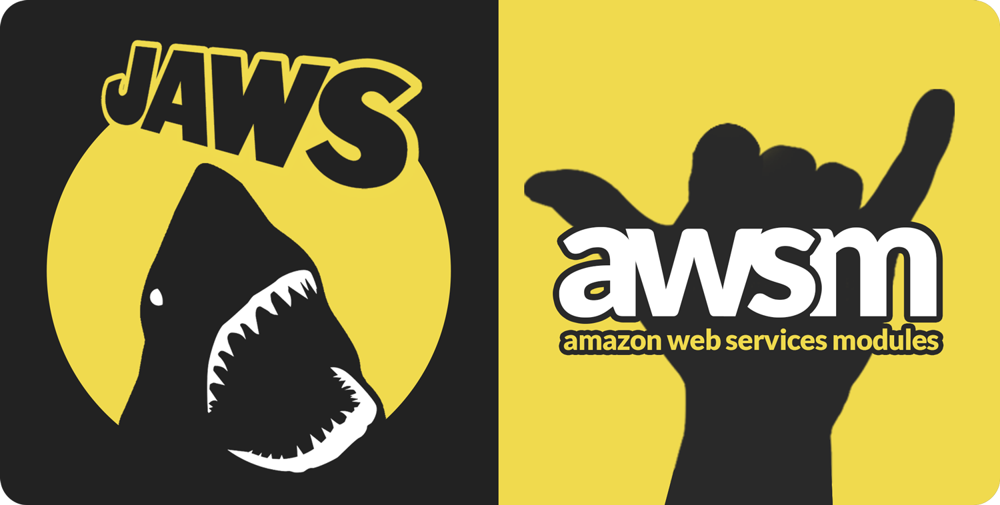

# JAWS: AWS-Modules (awsm)

JAWS applications' back-end runs on AWS Lambda functions which can be seen in the `aws_modules` folder.  To encourage the development of re-usable, standardized and optimized lambda functions, JAWS keeps all of your app's lambda functions in the **[AWS-Module](https://github.com/awsm-org/awsm) (awsm)** format.  This format was created for JAWS, and the JAWS CLI features commands to help you generate scaffolding for your aws_modules.

Possibly the best feature of `aws_modules` is they make it easy for developers to publish and share their lambda functions and encourage a module ecosystem.  In the near future, when you are building your serverless app, you will be able to select from a large variety of pre-written lambda functions, designed by the JAWS community for re-use, optimization, easy installation and deployment!

